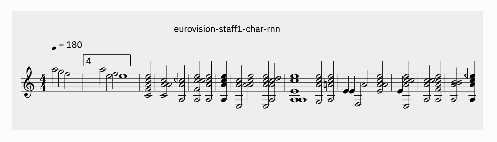
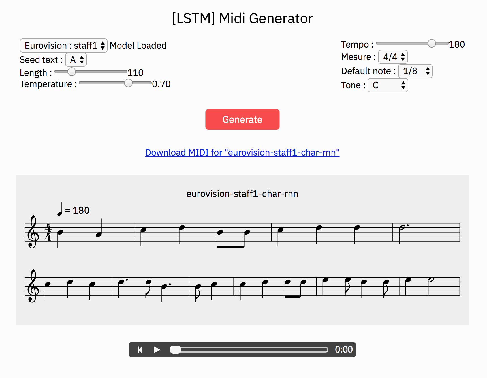

## Eurovision Char Rnn

###### Description

Tool used to generate midi files with a char rnn model formed from Eurovision songs

###### Creation of the database

- We have collected midi files from the eurovision rands 1, 2 and 3 through the web.
- Each midi format sound has been separated into 3 midi tracks (staff1 2 & 3).
- Each track of all ranks has been transformed into ABC notation to make them usable for an LSTM algorithm.
- The text file has been supplied to a CharRNN algorithm ([Ml5.js Training char RNN](https://github.com/ml5js/training-charRNN)) and the resulting model is used to generate new midi files.

The sources of the text files are here : [training-data](training-data)

An example of a generated song with a voice generated with GPT2 : [je-secoue-le-monde.mp3](readme-assets/je-secoue-le-monde.mp3)

###### Credit

- Concept : data.bingo
- Development : Bastien Didier

###### Gallery

